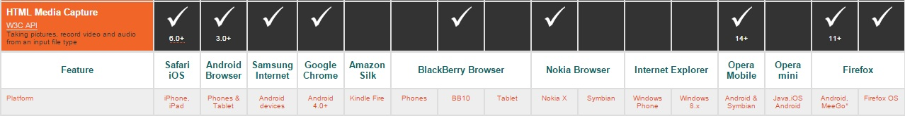

# Web-Picture

### Goal
This project meaning is just to be a tutorial for getting a picture from a WebBrowser. It have to work with:  
- iOS
- Android

### Technologies
I only look at HTML5 technologies.

[Here](http://mobilehtml5.org/) is a picture of the mobile browser compatibility.  
**WebRTC** seems to be the good solution from a technological point of view. But the compatibility is not here for now as safari does not implement it. It's fine for *Chrome*, *Firefox* and *opera*.  

**HTML Media Capture** is an old API from 2005. It was one of the first for taking picture, video or audio. It seems to be more limitative but should do the simple work needed here. The compatibility is better but still not really perfect as internet explorer doesn't follow. As iOS and Android are the focus here, I will go in that way.

